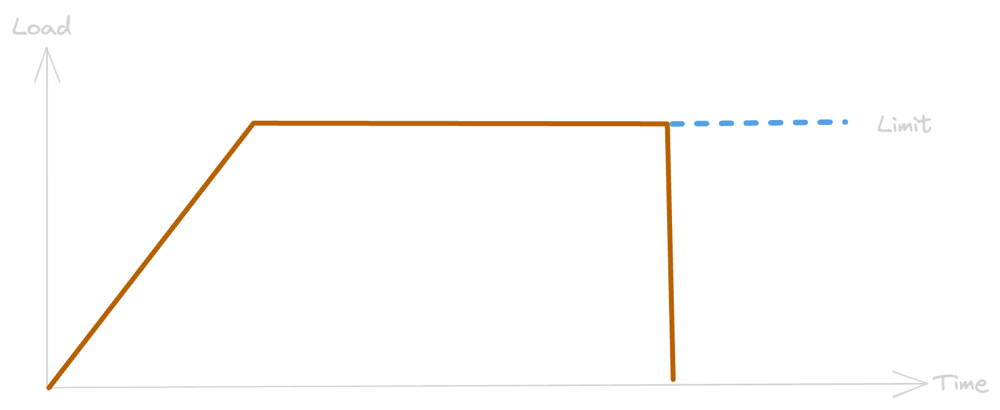
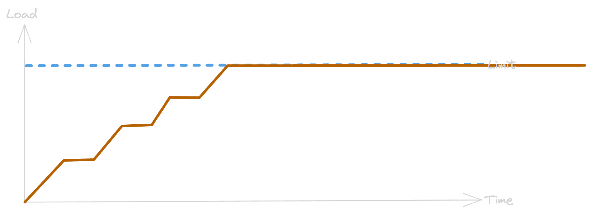

## Performance testing
with Taurus by Blazemeter

Note: authors : 
 - S. LAVAZAIS

Sources:
 - [Wikipedia - software performance testing](https://en.wikipedia.org/wiki/Software_performance_testing)
 - 
<!--v-->

## Introduction - Sommaire

1. What is performance test?
2. Test with Blazemeter Taurus
3. Demonstration

Note:
For this presentation, we're going to see roughly through the performance testing, and we're going to see how to work a solution to make performance testing easier and automated, "Taurus" by Blazemeter.

But first, let me introduce you what is performance testing and how many kinds of tests we can 
practice against an application.

1. What is performance testing?
2. What kind of tests?
   1. isolation testing
   2. load testing
   3. stress testing
   4. spike testing
   5. breakpoint testing
   6. soaking testing
3. Test with Blazemeter Taurus
4. Demo
5. Thanks!

<!--h-->

### What is performance testing?

Note:
Performance testing is the ability to put an application, with all its dependencies, in a "real-life" or a virtual 
context and observe how they behave.
<!--v-->

<!-- .slide: data-auto-animate -->
### What is performance testing?

   

      
responses over time

      
   

   

      
resources usage

      
   

   

      
capacity to scale

      
   

Note:
Performance testing provides direct benefits such as:
 - responses over time (direct)
 - resources usage (direct)
 - capacity to adapt / scalability (direct)
<!--v-->

<!-- .slide: data-auto-animate -->
### What is performance testing?

   

      
prevent downtime

      
   

   

      
detecting bug / bottleneck

      
   

   

      
mitigate security breach

      
   

Note:
Performance testing provides non-direct benefits such as:
- prevent downtime (non-direct)
- detecting uncovered bugs / bottleneck (non-direct)
- mitigate security breach (non-direct)
<!--v-->

### What kind of tests?

1. isolation testing
2. load testing
3. stress testing
4. spike testing
5. breakpoint testing
6. soaking testing

Note:
next, we're going to see the difference between test kinds, they can be applied 

<!--v-->

### isolation testing

Note:
this kind of test is to perform on a test bench (an isolated test case / context) by repeating test execution.

The tested part can be a bunch of code, or an isolated system.

<!--v-->

### load testing

Note:
The load test is the simplest way to test an application. 
The objective is to check if the application can manage the limit that has been decided before the test.
The application dependencies infrastructure services should also be monitored during the test.

in build context, this test can be used to monitor the application response time, and the objective to maintain.

<!--v-->

### stress testing

Note:
This kind of test is designed to determine the response limit for the tested application and/or the application 
dependencies.

(schema to redo)

<!--v-->

### spike testing

Note:
The spike testing aims to determine the performance issues when dramatic changes occur with application, like a large
amount of user connect at the same-time or a large fewer of users that disconnect.

<!--v-->

### breakpoint testing

Note:
This kind of test is to evaluate the load and the time when the tested application will fail.
Breakpoint testing is often referred to as Capacity testing because it can be use to determine if the 
SLA (Service Level Agreement) can be managed by the tested application.

<!--v-->

### soaking testing

Note:
The soaking testing or the "Endurance Testing" is done to determine if the tested application can sustain a continuous 
load during a tremendous amount of time.
Like load testing, the application dependencies infrastructure services should also be monitored during the test.

<!--h-->

### Test with Taurus By Blazemeter

Note:
